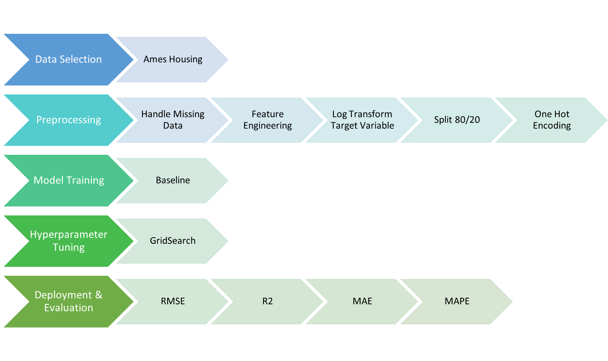

Slides: [Presentation slides](slides.html){target="_blank"}

## Introduction

The ability to predict residential sale prices is a million-dollar
question in real estate. Accurate valuations affect buyers, sellers,
lenders, appraisers, and local governments. A reliable predictive model
can help set listing prices, underwrite mortgages, estimate tax
assessments, assist insurance providers, guide investment decisions, and
help local governments in decision-making. Therefore, more accurate
price predictions reduce the chances of overpaying or underpricing a
home and make valuation models and appraisals more useful for companies
and individuals who directly buy, sell, and/or finance properties.

#### The Business Question

The business question this capstone project intends to address is: *How
well can a machine learning model like XGBoost predict real estate sale
prices using a transaction-level dataset from a metropolitan market, and
which features most influence those predictions?* This project intends
to achieve a model outcome that emphasizes price prediction accuracy
(how close predicted prices are to actual sale prices), robustness
within the market (how well the model generalizes within the same metro
area), and practical value (how the model can support those involved in
a real estate transaction).

#### Overivew of Approach

The real estate transaction data for this project will come from a
single market area, which is a deliberate choice. A single market
dataset allows us to dig into similar local features. This includes such
features as Lot Area, Lot Frontage, Year Built, Month Sold, and Overall
Condition. Several reviewed studies show that model performance and the
value of specific features depend heavily on local context
[@sharma2024optimal] and [@zaki2022house]. By focusing on one market,
this project is able to delve deeper into specific features of
properties in a particular geographic area, rather than have those
unique features lose meaning due to the generalization that occurs when
evaluating multiple markets. The goal is a careful and well-documented
application of a machine learning model like XGBoost that produces a
reliable predictive model for that market, along with lessons in data
selection, preprocessing, model training, and hyperparameter tuning that
others can adapt. This project will take a single comprehensive
transaction dataset for a metropolitan area, perform standard
preprocessing, traing the XGBoost model, and then implement
hyperparameter tuning with a pratical tuning workflow that balances
speed and thoroughness wherever possible. The final deliverable will
include a clear analysis of predictive performance, a discussion of the
most influential features, and practical notes for deploying the XGBoost
model in a chosen market.

### Literature Review

#### XGBoost: System Design, Strengths, and Tuning Practices

Research indicates that XGBoost is a practical choice for tabular data
[@chen2016xgboost]. XGBoost is engineered for speed, handles sparse
inputs, is scalable, and includes regularization that helps control
overfitting. Those model features matter when dealing with real estate
data because transaction tables often include many categorical features
and sparse data. Previous research reinforces the point that XGBoost is
powerful, but tuning matters. [@bentejac2019comparative] shows XGBoost
ranks highly when hyperparameters are optimized, but can perform poorly
without additional tuning. This fact encourages a careful, reproducible
tuning plan. Practical methods to speed up the tuning process are well
documented. [@kapoor2021simple] demonstrates that tuning on small,
uniformly sampled slices often preserves the ranking of hyperparameter
configurations and dramatically speeds up processing time. This is an
attractive strategy when training on the full dataset is slow.
[@verma2024exploring] provides sensible starting ranges for influential
parameters, so tuning is less guesswork. Experimental surveys such as
that demonstrated in [@ramraj2016experimenting] highlight XGBoost’s
speed advantage and the usefulness of feature importance outputs for
interpretation. Finally, [@zhang2022research] gives a reminder to treat
distributional issues carefully, a lesson that translates to regression
tasks with rare property types or extreme sale prices.

#### Evidence from Housing Applications: Predictive Gains and Feature Importance

Applied real estate housing studies consistently report that XGBoost
improves predictive accuracy over linear hedonic models when there are
many high-quality features, and preprocessing is carefully conducted.
[@sharma2024optimal] used a real estate transaction dataset and found
that XGBoost outperformed linear regression, multilayer perceptron,
random forest, and SVR across R², RMSE, and cross-validation metrics.
The authors emphasize hyperparameter tuning and feature selection. When
using smaller Kaggle datasets and municipal study datasets, others
reached similar conclusions after standard procerocessing and model
training, as seen in [@avanijaa2021prediction] and [@zaki2022house].
Further, several research papers show the value of expanding the feature
set beyond basic Multiple Listing Service (MLS) fields. [@zhao2019deep]
integrates image-based aesthetic scores from convolutional neural
networks with structured attributes and then uses XGBoost in a stacked
model. This added visual quality data showed improved prediction versus
tabular-only traditional data. [@li2021understanding] uses XGBoost to
rank predictors drawn from building records, POIs, night lights, and
street images. This showed that diverse contextual features are often
revealed to be the most important factors in predicting price. Another
research paper, [@moreno2025comparative], recommends pairing tree-based
ensembles like XGBoost with careful feature design and regional
variables to maximize the accuracy of predictions.

#### Feature Engineering, Data Scope, and Validation Choices for a Single Market

Across the research literature, feature design and data scope are as
important as model choice. Research papers repeatedly call out market
cycles, transit, neighborhood amenity counts, property condition, and
curb appeal as high-value predictors, as seen in [@li2021understanding]
and [@moreno2025comparative]. Other research papers, such as
[@sharma2024optimal] and [@avanijaa2021prediction], document
preprocessing to include missing value handling, outlier removal, and
categorical encoding that affect performance. Research by
[@zhao2019deep] shows image-derived features can capture latent quality
indicators not present in MLS fields. Moreover, focusing on one large
market has tradeoffs but also clear advantages. Several studies warn
that single-city datasets limit generalization [@sharma2024optimal],
[@zaki2022house]. However, that same local focus enables richer modeling
of micro-markets and neighborhood clusters, which are insights that are
directly useful to local appraisers, assessors, and lenders. Practical
tuning guidance is emphasized in [@kapoor2021simple] and
[@verma2024exploring]. Caution about sampling assumptions in
[@kapoor2021simple] and [@zhang2022research] show the importance of
using stratified or time-aware subsampling rather than simple uniform
data selection, so rare property types and localized areas are not
missed.

#### Interpretability, Fairness, and Practical Deployment Considerations

Even though the project’s primary goal is prediction, stakeholders care
about why a model makes certain estimates. Several research papers
recommend highlighting feature rankings and checking for distributional
bias. Research papers by [@ramraj2016experimenting] and
[@sharma2024optimal] highlight the practical value of feature importance
outputs. Additional research work by [@li2021understanding] and
[@zhao2019deep] show how contextual features such as green view, transit
proximity, and local economic indicators can be highlighted for planners
and lenders. The research paper by [@zhang2022research] emphasizes
fairness checks and handling imbalanced or rare cases, which is
important when a model will be used in lending or tax assessment.

## Methods

#### Study Design: Model and Data Selection

This project will be conducted as a supervised regression study aimed at
predicting residential sale prices from structured transaction‑level
data. The focus will be on developing a model that achieves strong
predictive accuracy while remaining robust within a single market
context. The model will also need to be interpretable to support real
estate decision‑making. This is why the predictive model chosen will be
Extreme Gradient Boosting (XGBoost), implemented as a gradient‑boosted
decision tree ensemble for regression. This method is well-suited for
structured, tabular datasets [@sharma2024optimal]; [@zaki2022house].
XGBoost was selected for its strong performance on structured datasets,
efficient handling of sparse inputs, and built‑in mechanisms to mitigate
overfitting [@chen2016xgboost]. These characteristics make it
particularly suitable for modeling housing prices, where relationships
between predictors and outcomes are often nonlinear and depend on
context.

#### Preprocessing

Data preprocessing will address missing values and "NA" values commonly
found in real estate transaction records. Proper steps will be taken to
ensure these values are handled differently dpending on whether they
indicate missing cvalues or are a meaningful category. Futhermore, data
stored as an incorrect tpye will be converted for proper model training.
Feasture engineering will be conducted to remove any highly correlated
features identified. The target variable will be examined for skewness,
and if necessary, a log transformation will be applied to enhance model
fit. All categorical vairables will be converted into a numerical format
using one‑hot encoding. This approach avoids imposing an ordinal
structure on nominal variables and is compatible with tree‑based
ensemble models such as XGBoost. One‑hot encoding is widely used in
housing price prediction studies and also supports efficient modeling of
sparse features [@avanijaa2021prediction].

#### Model Training

The dataset will be divided into training and testing sets using an
80%/20% split. The training subset will be used to fit model parameters,
while the testing subset will be reserved for evaluating performance
during model development. Model performance will be evaluated using the
coefficient of determination (R²) and Root Mean Squared Error (RMSE).
These metrics are standard in the housing price prediction literature
and allow comparison with prior studies evaluating XGBoost and related
models [@bentejac2019comparative]; [@sharma2024optimal].

#### Hyperparameter Tuning

Because prior research demonstrates that XGBoost performance is
sensitive to hyperparameter tuning, the modeling process will include a
hyperparameter tuning stage rather than relying on default settings.
Hyperparameter tuning will be performed using cross‑validated grid
search. The search will focus on key parameters that control ensemble
complexity and learning behavior, including the number of boosting
iterations, maximum tree depth, and learning rate. This tuning strategy
follows guidance from the research literature, which emphasizes
prioritizing high‑impact parameters to improve model performance while
maintaining processing efficiency where possible [@kapoor2021simple].

#### Deployment and Evaluation

Although predictive accuracy will be the primary objective, model
interpretability will also be prioritized. Feature importance measures
produced by the trained XGBoost model will be used to identify the most
influential predictors of housing prices. The ranking of the most
important features will support both evaluation and comparison with
findings in the research papers [@ramraj2016experimenting].

## Analysis and Results

### Data Exploration and Visualization

The dataset was sourced from the train.csv file of a Kaggle dataset
[house-prices-advanced-regression-dataset](https://www.kaggle.com/datasets/hassanjameelahmed/house-prices-advanced-regression-dataset).The
train.csv was chosen as the sole data source to prevent data leaking
from recombining with the test.csv data, which doesn’t contain the
prediction value (sales price).

According to the Kaggle page, the dataset was obtained from a Kaggle
competition called “House Prices: Advanced Regression Techniques”. Based
on the Ames Housing dataset, it was compiled for academic and machine
learning purposes as an alternative to the Boston Housing dataset,
making it an optimal choice for testing how well XGBoost predicts
property sales prices.

The train.csv data contains 1,460 records with details regarding
residential properties collected from the Ames Assessor’s Office in
Ames, Iowa. There are 81 features (including the unique identifier
“Id”), detailed in [@tbl-variables] and [@tbl-variables2] below, as
defined from the original Kaggle competition data_description.txt file
located on
[GitHub](https://raw.githubusercontent.com/rehassachdeva/House-Prices-Advanced-Regression-Techniques---Kaggle-Competition/refs/heads/master/data_description.txt).
Since several categorical variables contain a category NA that is
treated as null by the pandas library, the NA filter is set to False
when reading the CSV file to avoid it being treated as missing data. The
categories that exist in the data descriptions but not in the train.csv
data have been removed from the table below.

```{r}
#| message: false
#| warning: false

# run these two comments below in the console
#library(reticulate) # library to run python
#py_install(c("pandas", "numpy", "matplotlib", "seaborn", "xgboost", "scikit-learn", "plotly", "psutil"))
```

```{python}
#| message: false
#| warning: false
#| output: false

# packages
import pandas as pd
import numpy as np
import matplotlib.pyplot as plt
import seaborn as sns
import xgboost as xgb
import plotly.express as px
import time
from sklearn.model_selection import train_test_split, GridSearchCV
from sklearn.preprocessing import OneHotEncoder
from sklearn.metrics import mean_squared_error, r2_score
from datetime import timedelta

# load data
raw = pd.read_csv('https://raw.githubusercontent.com/douglasbogan/IDC6940_XGBoost_Douglas_Susanna/refs/heads/main/train.csv', na_filter=False)

# view variables, data type, null
raw.info()

# specify the categorical columns
categorical_columns = raw[['MSSubClass', 'MSZoning', 'Street', 'Alley', 'LotShape', 'LandContour', 'Utilities', 'LotConfig', 'LandSlope', 'Neighborhood', 'Condition1', 'Condition2', 'BldgType', 'HouseStyle', 'RoofStyle', 'RoofMatl', 'Exterior1st', 'Exterior2nd', 'MasVnrType', 'ExterQual', 'ExterCond', 'Foundation', 'BsmtQual', 'BsmtCond', 'BsmtExposure', 'BsmtFinType1', 'BsmtFinType2', 'Heating', 'HeatingQC', 'CentralAir', 'Electrical', 'KitchenQual', 'Functional', 'FireplaceQu', 'GarageType', 'GarageFinish', 'GarageQual', 'GarageCond', 'PavedDrive', 'PoolQC', 'Fence', 'MiscFeature', 'SaleType', 'SaleCondition']]

# print unique values of categorical columns
for col in categorical_columns:
    print(f"Unique values in '{col}': {raw[col].unique()}")
```

::: {#tbl-variables}
```{r}
library(DT)
#| message: false
#| warning: false

Cat = read.csv("Categorical_Description.csv")
datatable(Cat, options = list(pageLength = 5), rownames = FALSE, filter = 'top')
```

Categorical Variables in the Dataset
:::

------------------------------------------------------------------------

::: {#tbl-variables2}
```{r}
library(DT)
#| message: false
#| warning: false

Numb = read.csv("Numerical_Description.csv")
datatable(Numb, options = list(pageLength = 10), rownames = FALSE, filter = 'top')
```

Numerical Variables in the Dataset
:::

From the information, it is observed that MSSubClass is listed as an
integer data type, although it should be a categorical data type and
will require encoding. Additionally, LotFrontage, MasVnrArea, and
GarageYrBlt are numerical data but stored as categorical data, possibly
due to missing or null data read as a string when the CSV file was
loaded. No other missing values were found. Examining the unique values
presented also shows Electrical has an additional category NA, which is
not defined. A closer look at these columns is necessary to determine
how to handle them in preprocessing. A summary of possible action can be
found in @tbl-NA below.

```{python}
#| message: false
#| warning: false
#| output: false

# find erroneous NA values
non_categorical = raw[['LotFrontage', 'MasVnrArea', 'GarageYrBlt']]

for col in non_categorical:
    print(f"Count of NA in '{col}': {raw[col].value_counts().get("NA", 0)}")

print(f"Count of NA in 'Electrical': {raw['Electrical'].value_counts().get("NA", 0)}")
```

|             |                  |                           |
|:-----------:|:----------------:|:-------------------------:|
| **Column**  | **Number of NA** |        **Action**         |
| LotFrontage |       259        |     Replace NA with 0     |
| MasVnrArea  |        8         |     Replace NA with 0     |
| GarageYrBlt |        81        | Replace NA with YearBuilt |
| Electrical  |        1         |    Remove observation     |

: Summary of NA values found that represent missing data {#tbl-NA}

LotFrontage and MasVnrArea both could make sense at 0 to imply no
distance. GarageYrBlt matching with YearBuilt would be applying the same
logic as YearRemodAdd. Finally, Electrical’s NA could be eliminated
since there is only one occurrence, or changed into the highest category
value. Before proceeding with preprocessing or making final
determinations on how to handle these NA values, the target variable and
correlations amongst the variables should also be examined.

```{python target, fig.path="FinalFigures/", fig.format='png'}
#| message: false
#| warning: false
#| output: false

# distribution of target variable
raw['SalePrice'].plot(kind = 'hist', bins = 30, color = 'steelblue', edgecolor = 'black', title = "Sale Price")
plt.show()
```

{#fig-target fig-align="center"}

In @fig-target above, the target variable SalePrice appears
right-skewed, and may benefit from log transformation. The result of
this suggestion is compared in @fig-log below.

```{python log, fig.path="FinalFigures/", fig.format='png'}
#| message: false
#| warning: false
#| output: false

# testing log target variable
SalePrice_log = np.log(raw['SalePrice']).rename('SalePrice_log')

fig, axes = plt.subplots(nrows = 1, ncols = 2, figsize = (10, 5))
axes = axes.flatten()

raw['SalePrice'].plot(kind = 'hist', ax = axes[0], bins = 30, color = 'steelblue', edgecolor = 'black', title = "Sale Price")
SalePrice_log.plot(kind = 'hist', ax = axes[1], bins = 30, color = 'teal', edgecolor = 'black', title = "Sale Price (log transformed)")

plt.tight_layout()
plt.show()
```

{#fig-log fig-align="center"}

It can be confirmed visually that log-transforming SalePrice will
contribute to more normally distributed data and benefit the model. 

Next, the correlation between variables should be examined to reduce
multicollinearity. To include the appropriate numerical variables, the
proposed changes in @tbl-NA above for handling NA values and the log
transformation of SalePrice are included in the correlation matrix in
@fig-correlation below.

```{python correlation, fig.path="FinalFigures/", fig.format='png'}
#| message: false
#| warning: false
#| output: false

# specify the numerical columns
numerical_columns = raw[['LotArea', 'OverallQual', 'OverallCond', 'YearBuilt', 'YearRemodAdd', 'BsmtFinSF1', 'BsmtFinSF2', 'BsmtUnfSF', 'TotalBsmtSF', '1stFlrSF', '2ndFlrSF', 'LowQualFinSF', 'GrLivArea', 'BsmtFullBath', 'BsmtHalfBath', 'FullBath', 'HalfBath', 'BedroomAbvGr', 'KitchenAbvGr', 'TotRmsAbvGrd', 'Fireplaces', 'GarageCars', 'GarageArea', 'WoodDeckSF', 'OpenPorchSF', 'EnclosedPorch', '3SsnPorch', 'ScreenPorch', 'PoolArea', 'MiscVal', 'MoSold', 'YrSold', 'SalePrice']]

# testing replacing NA for numerical columns and SalePrice log
all_numerical_col = pd.concat([non_categorical[['LotFrontage', 'MasVnrArea']].apply(pd.to_numeric, errors = 'coerce').fillna(0).astype(int),
                               non_categorical['GarageYrBlt'].apply(pd.to_numeric, errors='coerce').fillna(raw['YearBuilt']).astype(int),
                               numerical_columns, SalePrice_log], axis = 1)
all_numerical_col = all_numerical_col.drop(columns = ['SalePrice'])

# correlation matrix color map
corr = all_numerical_col.corr()
annot = corr.map(lambda x: '{:.2g}'.format(x) if abs(x) > 0.85 else '')
mask = np.triu(np.ones_like(corr, dtype = bool))
f, ax = plt.subplots(figsize = (10, 10))
sns.heatmap(corr, mask = mask, cmap = 'coolwarm', vmin = -1, vmax = 1, center = 0, square = True, linewidths = .5, cbar_kws = {'shrink': .5}, annot = annot, annot_kws = {'color': 'black'}, fmt = '')
ax.set_title('Correlation Matrix')
ax.set_xticklabels(ax.get_xticklabels(), rotation = 45, ha = 'right')
plt.show()
```

{#fig-correlation
fig-align="center"}

In the correlation matrix, values greater than 0.85 are annotated for
ease of identification. This only incorporates the correlation between
GarageArea and GarageCars, meaning they have similar information that
could reduce the accuracy of the model. As a result, one of the columns
could be dropped to reduce multicollinearity.

### Modeling and Results

Before deployment, the XGBoost model will be trained to establish a
baseline for the evaluation metrics: coefficient of determination (R²)
and Root Mean Squared Error (RMSE). These evaluation metrics were chosen
to reflect our goal of developing a model that can accurately predict
sales price and answer our research question: *How well can a machine
learning model like XGBoost predict real estate sale prices using a
transaction-level dataset from a metropolitan market, and which features
most influence those predictions?* While R² reflects how well the model
fits the data, RMSE shows how accurately the model predicts the target
variable. [@fig-analysis] below provides an overview of the process
performed in this study.

{#fig-analysis
fig-align="center"}

#### Preprocessing

As discovered in the data exploration and visualization section, the
dataset contains several categorical features, many of which use “NA” as
a meaningful category rather than to represent missing data. To handle
this dataset, the steps shown in @tbl-NA above were implemented to fill
in or remove missing data. Additionally, the data types originally
stored as an incorrect type, as identified in @tbl-variables and
@tbl-variables2 were converted to their proper data type.  

```{python}
#| message: false
#| warning: false
#| output: false

# handle missing data & convert data types
data = raw.copy()
data[['LotFrontage', 'MasVnrArea']] = data[['LotFrontage', 'MasVnrArea']].apply(pd.to_numeric, errors = 'coerce').fillna(0).astype(int)
data['GarageYrBlt'] = data['GarageYrBlt'].apply(pd.to_numeric, errors='coerce').fillna(raw['YearBuilt']).astype(int)
data = data[~data['Electrical'].str.contains("NA")]
data['MSSubClass'] = data['MSSubClass'].astype('object')

# double check
print(f"Count of NA in 'LotFrontage', 'MasVnrArea', 'GarageYrBlt': {data[['LotFrontage', 'MasVnrArea', 'GarageYrBlt']].value_counts().get("NA", 0)}")
print(f"Count of NA in 'Electrical': {data['Electrical'].value_counts().get("NA", 0)}")
print(data[['LotFrontage','MasVnrArea','GarageYrBlt','MSSubClass']].dtypes)
```

Feature engineering was then conducted to remove highly correlated
feature GarageArea, as identified in the correlation matrix in
@fig-correlation.

```{python}
#| message: false
#| warning: false
#| output: false

# feature engineering - drop high correlation column
data = data.drop(columns = ['GarageArea'])
```

Since the target variable continued to exhibit skewness seen in @fig-log
in the above section, a log transformation was applied to improve model
fit. This was the final preprocessing step conducted as determined in
the data exploration.

```{python}
#| message: false
#| warning: false
#| output: false

# log transform target variable
data_log_y = np.log(data['SalePrice']).rename('SalePrice_log')

# replace target variable with log version
data_log = pd.concat([data, data_log_y], axis = 1)
data_log = data_log.drop(columns = ['SalePrice'])
```

Next, the data was split into training and testing sets at an 80%/20%
ratio to ensure sufficient data for both model training and evaluating
the prediction accuracy.

```{python}
#| message: false
#| warning: false
#| output: false

# split 80/20 to create train and test
X, y = data_log.iloc[:, 1:79], data_log.SalePrice_log
X_train, X_test, y_train, y_test = train_test_split(X, y, test_size = 0.2, random_state = 1)

# checking results
print("X_train:", X_train.shape)
print("X_test:", X_test.shape)
print("y_train:", y_train.shape)
```

Finally, categorical variables were encoded using one-hot encoding,
which avoids incorrectly imposing an ordinal relationship in the data.
XGBoost, being a tree-based model, is not reliant on or heavily impacted
by numerical values and the differences between them. As a result,
feature scaling was not performed.

```{python}
#| message: false
#| warning: false
#| output: false

# one hot encoding
# categorical columns
categorical = X_train.select_dtypes(include = 'object').columns

# numerical columns
numerical = X_train.select_dtypes(exclude = 'object').columns

# define encoder
OneHot = OneHotEncoder(handle_unknown = "ignore", sparse_output = False)

# fit on train
OneHot.fit(X_train[categorical]);

# transform train and test
Xtrain_cat = OneHot.transform(X_train[categorical])
Xtest_cat  = OneHot.transform(X_test[categorical])

# convert back to df
col_names = OneHot.get_feature_names_out(categorical)
Xtrain_cat = pd.DataFrame(Xtrain_cat, columns = col_names, index = X_train.index)
Xtest_cat  = pd.DataFrame(Xtest_cat,  columns = col_names, index = X_test.index)

# recombine w/numeric columns
Xtrain_encoded = pd.concat([X_train[numerical], Xtrain_cat], axis = 1)
Xtest_encoded  = pd.concat([X_test[numerical],  Xtest_cat], axis = 1)

# checking results
print("X_train:", X_train.shape)
print("X_test:", X_test.shape)
print("y_train:", y_train.shape)
```

#### Model Training

XGBoost was selected as the sole model for this dataset due to its
strong performance with categorical data, efficiency, and resistance to
overfitting. To establish a baseline for evaluation, the model was first
trained with default hyperparameters. The baseline results for RMSE and
R² can be found in @tbl-baseline below.

```{python}
#| message: false
#| warning: false
#| output: false

# model - xgboost
model = xgb.XGBRegressor(random_state = 1)
model.fit(Xtrain_encoded, y_train);
pred = model.predict(Xtest_encoded)
```

```{python}
#| message: false
#| warning: false
#| output: false

# evaluate default as baseline
# RMSE
RMSE = np.sqrt(mean_squared_error(y_test, pred))

# R2
R2 = r2_score(y_test, pred)

print(f"RMSE: {RMSE:.4f}")
print(f"R²: {R2:.4f}")
```

| Metric | Value  |
|:------:|:------:|
|  RMSE  | 0.1264 |
|   R²   | 0.9029 |

: XGBoost baseline evaluation results {#tbl-baseline}

These results indicate that the model already explains 90% of the
variance for the target variable. Additionally, the lower value in RMSE
indicates the model's strength in predicting sales price.

#### Hyperparameter Tuning

Although currently performing adequately, hyperparameter tuning could
improve both metrics. GridSearchCV was used to evaluate several
parameters that can be further examined in the code block below.

```{python}
#| message: false
#| warning: false
#| output: false

# tracking time of code block execution
start_time = time.monotonic()

# hyperparameter tuning - GridSearch
# takes ~ 45-60 mins
param_grid = {
    "n_estimators": [300, 500, 800],
    "learning_rate": [0.01, 0.05, 0.1],
    "max_depth": [4, 6, 8],
    "subsample": [0.7, 0.8, 1.0],
    "colsample_bytree": [0.7, 0.8, 1.0],
}

xgb_model = xgb.XGBRegressor(objective = "reg:squarederror", random_state = 1)

grid = GridSearchCV(
    estimator = xgb_model,
    param_grid = param_grid,
    scoring = "neg_root_mean_squared_error",
    cv = 5,
    verbose = 1,
    n_jobs = 1
)

grid.fit(Xtrain_encoded, y_train);

# outputs time code block took
end_time = time.monotonic()
print(timedelta(seconds = end_time - start_time))
```

After 30 to 60 minutes, the following best parameters were identified:

-   colsample_bytree: 0.7
-   learning_rate: 0.05
-   max_depth: 4
-   n_estimators: 800
-   subsample: 0.7

Although some adjustments and re-evaluations were conducted to ensure an
efficient GridSearch was performed, once the best parameters were
identified, they were applied to the final model.

#### Deployment & Evaluation

After forming the tuned model, RMSE and R² were re-evaluated against the
baseline model. The tuned evaluation metrics can be found in @tbl-tuned
below.

```{python}
#| message: false
#| warning: false
#| output: false

# evaluate tuned
pred_tuned = grid.best_estimator_.predict(Xtest_encoded)

RMSE_tuned = np.sqrt(mean_squared_error(y_test, pred_tuned))
R2_tuned = r2_score(y_test, pred_tuned)

print("Best parameters:", grid.best_params_)
print(f"Tuned RMSE: {RMSE_tuned:.4f}")
print(f"Tuned R²: {R2_tuned:.4f}")
```

|            |              |           |
|:----------:|:------------:|:---------:|
| **Metric** | **Baseline** | **Tuned** |
|    RMSE    |    0.1264    |  0.1208   |
|    R\^2    |    0.9029    |  0.9113   |

: Comparison of baseline and tuned evaluation metrics {#tbl-tuned}

Both RMSE and R² showed that the tuned model improved in both fit and
prediction accuracy.

To determine which feature had the greatest impact on the target
variable, sales price, feature importance was visualized in
@fig-important below.

```{python important, fig.path="FinalFigures/", fig.format='png'}
#| message: false
#| warning: false
#| output: false

# feature importance
xgb.plot_importance(grid.best_estimator_, grid = False,
                    title = "20 Most Important Features",
                    ylabel = "Feature Name", xlabel = "Score",
                    max_num_features = 20, values_format = '{v:.0f}')
plt.show()
```

{#fig-important
fig-align="center"}

The top three most influential factors include LotArea, LotFrontage, and
GrLivArea, which highlight the importance that the lot size and living
area have on the sale price of a home in Ames, Iowa.

To further evaluate model performance, actual sales prices were compared
to the predicted values after converting the log-transformed predictions
back to the original unit, U.S. Dollars (\$). An interactive
visualization can be found in the interactive graph below.

```{python plotly}
#| message: false
#| warning: false
#| output: false

# plotly interactive predicted vs actual
df_pred = pd.DataFrame({
    'Actual_log': y_test,
    'Predicted_log': pred_tuned
})

df_pred['Actual'] = np.exp(df_pred['Actual_log'])
df_pred['Predicted'] = np.exp(df_pred['Predicted_log'])

df_long = pd.DataFrame({
    'Value': pd.concat([df_pred['Actual'], df_pred['Predicted']], ignore_index = True),
    'Type': (['Actual'] * len(df_pred)) + (['Predicted'] * len(df_pred)),
    'Index': list(range(len(df_pred))) * 2,
    'Actual': list(df_pred['Actual']) * 2,
    'Predicted': list(df_pred['Predicted']) * 2
})

color_map = {'Predicted': 'RoyalBlue', 'Actual': 'PaleGreen'}
fig = px.scatter(df_long, x = 'Index', y = 'Value',
                 color = 'Type', color_discrete_map = color_map,
                 title = "Actual vs Predicted Value of Target Variable (Dollars)",
                 opacity = .8, custom_data = ['Actual', 'Predicted'])

for trace in fig.data:
    if trace.name == "Predicted":
        trace.hovertemplate = (
            "Row Index: %{x}<br>"
            "Actual: $%{customdata[0]:,.2f}<br>"
            "Predicted: $%{customdata[1]:,.2f}<br>"
        )
    else:
        trace.hovertemplate = None
        trace.hoverinfo = "skip"

fig.update_layout(template = 'plotly_white',
                  xaxis_title = "Data Row Index", yaxis_title = "Sale Price (Dollars)"),
fig.show()
```

Interactive graph showing predicted vs actual sales price

The model performs consistently across most of the price range. It can
be observed, however, that as the sales prices approach the upper end of
the distribution, the difference between the predicted and actual values
increases. This could be due to the more complex pricing of higher-end
homes.

### Conclusion

## References

::: {#refs}
:::

## Appendix

### Appendix I: Research Article Summaries

#### Prediction of House Price Using XGBoost Regression Algorithm

This research paper sets out to build a practical model that predicts
house sale prices so buyers and sellers can make better decisions. The
authors show that this problem matters because prices change with
location, neighborhood and amenities. The author also explains how they
cleaned and prepared a Kaggle dataset (about 80 features and \~1,500
records) using standard steps like filling missing values, removing
outliers, and converting categories with one hot encoding. They then
train an XGBoost regression model and compare different
train/validation/test splits. The best split (80/10/10) produced the
lowest test error (about 4.4%). The paper concludes that XGBoost
improves prediction accuracy and reduces investment risk for customers.
It also notes limits like that house prices vary by region and more
features or deeper models could further reduce error and broaden
applicability. The authors recommend expanding the database to include
more cities and exploring deeper learning methods as future work
[@avanijaa2021prediction].

#### A Comparative Analysis of XGBoost

As the title implies, the article compares the methods random forest,
gradient boosting, and eXtreme Gradient Boosting (XGBoost) and
highlights the importance of parameter tuning for accuracy and speed.
Furthermore, the authors explored additional goals, including
identifying the most efficient combination of parameters for XGBoost and
exploring alternative grids for the methods. The authors go into depth
about each method, including advantages and disadvantages, as well as
the attributes that were adjusted. To show the importance of a
consistent and fair analysis, they not only explain this as the reason
for not utilizing the built-in feature of XGBoost to handle missing
values, but also detail the computer processor used to run the models.
The analysis used data from 28 datasets of varying size (and missing
values) from the UCI repository across different application fields. To
compare the methods, first, a stratified 10-fold cross-validation with
grid search was conducted on the training set to select the best
parameters. In order to create a more optimized parameter combination
for XGBoost, the training set was run against each possible combination
of parameters among five: learning_rate, gamma, max_depth,
colsample_bylevel, and subsample. Next, the default parameters for each
of the three methods were compared. The analysis was concluded by
calculating the generalization accuracy of the parameters found from the
grid search, default, and various XGBoost results against the test data.
Results across the 28 datasets showed XGBoost achieved the
second-highest accuracy when using optimized (tuned) parameters, but the
worst when using default parameters. Rankings determined using the
Nemenyi test found similar results; XGBoost with optimized parameters
was the highest average rank. Finally, XGBoost also had the fastest
performance, without taking into account grid search time (because the
grid sizes are different across the methods). Overall, the results
effectively highlighted how often tuned or default methods perform
depending on the contents of the dataset, including noise, missing
values, overfitting, etc [@bentejac2019comparative].

#### XGBoost: A Scalable Tree Boosting System

In the paper, the authors focus on the advantages of XGBoost as a widely
used, effective, open-source, portable, and scalable machine learning
method that is resistant to overfitting. They point out several use
cases for challenges on Kaggle.com including statistics surrounding 2015
challenges where XGBoost was utilized in winning challenges. The goal of
the paper was to highlight optimizations for XGBoost, such as its
ability to handle sparse data, speed, and scalability. To do this, the
authors outline their contributions on page 2:

-   "…design and build a highly scalable end-to-end tree boosting
    system"
-   "…propose a theoretically justified weighted quantile sketch for
    efficient proposal calculation"
-   "…introduce a novel sparsity-aware algorithm for parallel tree
    learning"
-   "…propose an effective cache-aware block structure for out-of-core
    tree learning"

The paper explains each point with figures and mathematical equations,
briefly addressing limitations when applicable, but primarily focusing
on the advantages of XGBoost when analyzing large data from four
sources. The data chosen was split into test and training data, and
ranges in size from 473,000 to 1.7 billion observations and 28 to 4227
features across tasks such as insurance claim classification, event
classification, ranking, and ad click-through rate prediction to
highlight the efficiency and scalability of XGBoost in real-world
applications [@chen2016xgboost].

#### A Simple and Fast Baseline for Tuning Large XGBoost Models

This research paper shows a simple, practical method to make tuning
XGBoost much faster on very large tables of data: train and test on
small, uniformly sampled slices of the dataset, then use those results
to pick promising settings before training on the full data. The goal
was to speed up hyperparameter tuning for XGBoost when datasets are huge
and full training is slow. The authors of this paper found three
surprising and useful things. For one, training time scales almost
linearly with dataset size (so a 10% slice trains about 10× faster).
Secondly, good hyperparameter choices on small slices tend to stay good
on the full data (the ranking of configurations is preserved). And
third, tuning on as little as 1% of the data often finds settings that,
after retraining on the full set, perform nearly as well (average gap
falls from \~3.3% to \~1.4%). They tested this across multiple 15–70 GB
tabular datasets and showed that resource‑aware search methods like
Hyperband (and Hyperband combined with Bayesian optimization) find
strong models far faster than a blind random search.

Further, the paper highlights that XGBoost continues to excel on large
tabular problems. It’s scalable, robust, and surprisingly tolerant of
being tuned on small, representative samples. The main limitation is
that uniform subsampling assumes the data are independent, identically
distributed, and representative. If the dataset has strong biases or
rare subgroups, simple uniform sampling can miss them and hurt results.
The authors suggest future work on smarter sampling strategies to make
the approach more reliable in those cases. Overall, the takeaway is
practical and optimistic: a very easy baseline of uniform subsampling
plus multi‑fidelity tuning gives big speedups with only modest tradeoffs
in accuracy, and reveals unexpectedly favorable behavior of XGBoost on
large, real‑world tabular data [@kapoor2021simple].

#### Understanding the Effects of Influential Factors on Housing Prices by Combining Extreme Gradient Boosting and a Hedonic Price Model (XGBoost-HPM)

This research paper aims to better explain why housing prices vary
across a city by combining a modern machine‑learning tool (XGBoost) with
a traditional economic method (the hedonic price model or HPM). The goal
was to rank which factors matter most and then put dollar‑value meaning
on those factors. Using multiple sources of urban data for Shenzhen to
include building records, POIs, night‑lights, road networks and
street‑level images, the authors used XGBoost to find the most important
predictors. They then ran an HPM to quantify how those predictors relate
to price. The work is important because the HPM alone struggles with
nonlinearity and collinearity. However, XGBoost can detect nonlinear
effects and rank variable importance. Combining both models gives both
strong prediction and interpretable economic effects. Key results showed
that XGBoost achieved high predictive performance and identified the top
five drivers of Shenzhen prices as distance to city centre, green view
index, population density, property management fee, and local economic
level. The HPM confirmed that street‑level greenness (green view index)
and several community and locational factors have statistically
significant effects on price. Limitations noted included that the study
is cross‑sectional (no temporal dynamics), street‑view scene proportions
could be richer to capture perceptions, and the framework was tested
only in Shenzhen so broader generalization needs data from more cities.
Overall, the paper shows a practical, data‑rich way to combine XGBoost’s
strength in feature selection and nonlinear modeling with HPM’s ability
to estimate economic effects, producing both accurate maps of price
variation and interpretable policy insights for urban planning
[@li2021understanding].

#### Comparative Analysis of Advanced Models for Predicting Housing Prices: a Review

This review compares traditional hedonic price models (HPM) with machine
learning approaches for predicting housing prices and finds a clear
complementarity effect between HPM and machine learning models, such as
XGBoost. HPMs remain an important tool for interpretation, revealing
which property attributes like location, size, neighborhood features,
and distance to centers drive value, while machine learning models
deliver superior predictive accuracy by capturing non‑linear
relationships and complex interactions that linear regressions miss.
Tree‑based and ensemble methods dominate recent studies. Random Forest
is the most frequently used model, and gradient‑boosted algorithms such
as XGBoost and LightGBM often achieve the highest fit and the lowest
error metrics (higher R\^2, lower RMSE/MAPE) when regional or cluster
variables are included. XGBoost in particular excels at handling large
datasets, modeling non‑linear effects from amenities and spatial
clusters, and improving fit when economic or geographic clusters are
added. In several comparative studies it produced the best balance of
high R\^2 and low absolute error. The paper also highlights that
ensembles and hybrid approaches typically outperform single models, and
that predictive gains depend heavily on the quality and breadth of input
variables. External contextual features (transport access, neighborhood
socioeconomic indicators) materially improve results. Therefore, if
seeking both interpretability and accuracy, the research paper suggests
pairing HPM for explanation with tree‑based and/or boosted ML models
(notably XGBoost) for prediction. This combination yields robust insight
into value drivers while tightening forecasts. In conclusion, XGBoost is
a strong contender as a machine learning model for house price
predictions [@moreno2025comparative].

#### Experimenting XGBoost Algorithm for Prediction and Classification of Different Datasets:

This research paper gives an analysis of different advantages of XGBoost
as a machine learning methodology. XGBoost is presented in this research
paper as a faster, more streamlined progression of traditional Gradient
Boosting, especially well‑suited for structured machine learning tasks.
Across four datasets which include two classification datasets and two
regression datasets, the authors show that XGBoost often matches or
exceeds Gradient Boosting’s accuracy on classification problems and
delivers comparable but sometimes more variable results on regression.
Its biggest advantage is speed: by redesigning how trees are built and
processed, XGBoost trains on data dramatically faster while still
producing competitive models. The study also highlights how XGBoost’s
feature‑importance outputs help interpret which variables drive
predictions. The authors conclude that although XGBoost isn’t guaranteed
to always be more accurate, its efficiency and practical design make it
a strong choice for many real-world problems [@ramraj2016experimenting].

#### An Optimal House Price Prediction Algorithm: XGBoost

The study utilized a Kaggle.com dataset of Ames City, Iowa housing data
composed of 2930 records of 82 features to predict house prices.
Motivated by other studies, which were narrowly focused on model
development and a classification approach (higher or lower than listed
price), the authors strived instead for a regression approach focusing
on optimizing the prediction model and identifying the most influential
predictors. The paper highlights the economic importance of accurate
predictions, such as consumer spending, borrowing capacity, investment
decisions, and impacts on real estate operations, including mortgage
lenders. The study was conducted following a six-stage machine learning
(ML) pipeline: (1) data collection, (2) data preprocessing, (3) model
training, (4) model tuning, (5) prediction and deployment, and (6)
monitoring and maintain. Analysis began by comparing five methods to
find the best performing model: "…linear regression (LR), multilayer
perceptron (MLP), random forest regression (RF), support vector
regressor (SVR), and extreme gradient boosting (XGBoost)…" (p. 33).
Detailed explanations of each methods benefits, limitations, and
equations were provided. XGBoost was emphasized "…based on its
interpretability, simplicity, and performance accuracy" (p. 31) as well
as its resistance to overfitting and ability to solve real-world
problems efficiently. Initial analysis revealed that XGBoost
outperformed the other models in terms of R-squared, adjusted R-squared,
mean squared error (MSE), root mean squared error (RMSE), and
cross-validation (CV) metrics. Each metric also had a brief description
and equation listed, satisfying a goal stated in the paper, "to provide
a thorough understanding of the metrics used for the model comparisons
and the selection of the best-performing model" (p. 38). Similarly, the
authors demonstrated the importance of hyperparameter tuning through
GridSearchCV, KerasTuner, and RandomSearchCV. The model comparisons were
reproduced with GridSearchCV hyperparameter tuning, again resulting in
XGBoost performing the best. Feature selection was also conducted to
reduce dimensionality. Noted limitations included reliance on a sole
dataset, which only included one city and had unknown reliability, as
well as acknowledging possible influence from infrastructure variables
such as parks, hospitals, and transportation, on housing prices
[@sharma2024optimal].

#### Exploring Key XGBoost Hyperparameters: A Study on Optimal Search Spaces and Practical Recommendations for Regression and Classification

This research paper set out to make tuning XGBoost less guesswork and
more practical by identifying sensible starting ranges for four
influential hyperparameters so practitioners can get strong results
without wasting computational resources. This is important because
XGBoost is a powerful, widely used algorithm that can handle large and
messy datasets, but exhaustive tuning is slow and costly, so focused
guidance saves time and resources. The authors ran experiments on
several real datasets covering both regression and classification,
varied each parameter across broad ranges, and evaluated model
performance using standard train/test splits. Their work showed why
XGBoost is effective. Its parallelized training, regularized objective,
sparsity handling, and flexible loss functions make it well suited for
large, noisy problems, while also demonstrating that performance depends
heavily on sensible hyperparameter choices. The practical outcome is a
set of recommended ranges that help avoid overfitting and unnecessary
complexity, and the paper notes that more efficient Bayesian
optimization methods can be used to refine tuning further. Limitations
include the use of simple train/test splits rather than exhaustive
cross‑validation and the remaining computational cost of tuning on very
large datasets. However, the recommendations provide a clear, actionable
starting point for faster, more reliable XGBoost tuning
[@verma2024exploring].

#### House Price Prediction Using Hedonic Pricing Model and Machine Learning Techniques

The study is motivated by the importance of real estate markets and
property values to local governments' decision-making and to their
economic growth and development. To avoid events such as the 2008
recession, new machine learning techniques (MLTs) can predict property
prices more accurately, efficiently, and practically than current
models, and help prevent overinflated property values. To test this,
data sourced from Kaggle.com, consisting of 506 observations and 14
features of Boston, MA, was first processed by removing noisy data,
performing correlation analysis, and feature encoding. Then, with a
67/33 split, the authors develop a model, estimate housing prices, and
finally compare XGBoost and hedonic models using several evaluation
metrics, including RMSE, recall, precision, f-measure, and sensitivity,
with the end result being the R-squared score. XGBoost was found to
produce double the accuracy of the hedonic model. A limitation of the
study was that other adjustments (mortgage costs, insurance, historic
property valuation, risk, etc.) were not considered [@zaki2022house].

#### Research and Application of XGBoost in Imbalanced Data

The article shows that although XGBoost is a strong ensemble method, it
may not be the best choice for handling imbalanced categorical data. The
authors highlight the importance of such data in fields utilizing
artificial intelligence (AI) and machine learning (ML), such as medicine
and finance, where, for example, a category displaying non-fraudulent
charges may significantly outnumber fraudulent charges. The goal of the
paper was to overcome typical evaluation methods focused on accuracy
that misclassify imbalanced classes and instead determine a "…higher
recognition rate and better classification prediction effect." (p. 9).
The data, which underwent a 70/30 split, was sourced from two datasets:
(1) Taiwan credit card data from the UCI website that included one
categorical variable that predicted if the member would become
delinquent, and (2) credit card fraud data from ULB European machine
learning labs, with a binomial category of fraud or not. The analysis
encompassed three phases. First, the authors looked for missing values,
performed statistical analysis, and conducted standardization. Next,
outliers were examined and combined with nearby classes to locate and
reduce imbalance. Finally, feature selection was performed. To conduct
the analysis, an algorithm was created consisting of: support vector
machine (SVM), synthetic minority over-sampling technique (SMOTE)
referred to as "SVM-SMOTE", EasyEnsemble, XGBoost, Bayesian parameter
optimization, and a 10 K-fold cross-validation. The algorithm was
efficiently referred to as "SEB-XGB". Comparison was first made against
XGBoost (with default parameters), SEB-XGB, and the algorithms formed in
between, then other models RUSBoost, CatBoost, LightGBM, and
EBB-XGBoost. The article discussed the methods used in the analysis in
depth, in addition to the computing setup, packages used, and their
versions. Evaluated on area under the curve (AUC) and G-mean values to
determine feasibility and effectiveness, the SEB-XGB model performed
better than XGBoost and the additional combinations/models. However, the
authors did address that a limitation of the analysis was that the
classification features in the data were binary, which could be
impacting the results [@zhang2022research].

#### Deep Learning with XGBoost for Real Estate Appraisal

In the paper, the authors strive to consider unstructured and structured
data to accurately predict real estate prices using a hybrid deep
learning model that includes XGBoost at its topmost layer. Accuracy in
real estate prices impacts many businesses and individuals – real estate
agents, home buyers and sellers, insurance companies, lenders, and
governments – which served as the motivation for the authors. The
authors explain how XGBoost is often used in data science for image
classification for things like social media and image aesthetics,
leading to their data source. The unstructured data, typically
high-quality property images taken by photographers, was sourced from
AVA, a large database for aesthetic visual analysis, then combined with
structured, factual data from an online Australian website to conduct
the analysis, and the Google Maps API for geographical coordinates. Some
pre-processing was done to eliminate data with low observations of
photos and suburbs, and the data was split into an 80%/20% training and
test set. To conduct the analysis, first, an aesthetic score was
automatically assigned to the chosen property images from 1-10, 10 being
the most aesthetically pleasing, based on the AVA score. AVA scores were
pre-determined based on personal judgement of claimed photographers’
votes, leaving a possible objective limitation on the analysis that the
authors sought to combat – the impact of appraiser or real estate
agents' personal judgement in home prices. Regardless, once the scores
were obtained, 4 images from each property were cropped and combined
into a single larger image to extract visual contents. Next, a mean
quality assessment score was assigned from the results of a hybrid model
consisting of a convolutional neural network (CNN), MLP, and XGBoost,
among other layers detailed in the text. Finally, these assessment
scores were combined with the structured data to predict price.
Evaluated against mean absolute error (MAE) and mean absolute percentage
error (MAPE), XGBoost was found to be the most accurate model (compared
to the K-Nearest Neighbors (KNN) algorithm) in determining housing
prices from the structured and unstructured data [@zhao2019deep].

### Appendix II: Disclaimers

#### Conflicts of Interest

The authors declare no conflicts of interest.

#### Artificial Intelligence (AI)

AI was used solely for brainstorming or suggesting revisions to writing
or code. All writing and code presented is the work of the authors
unless otherwise cited in references.
