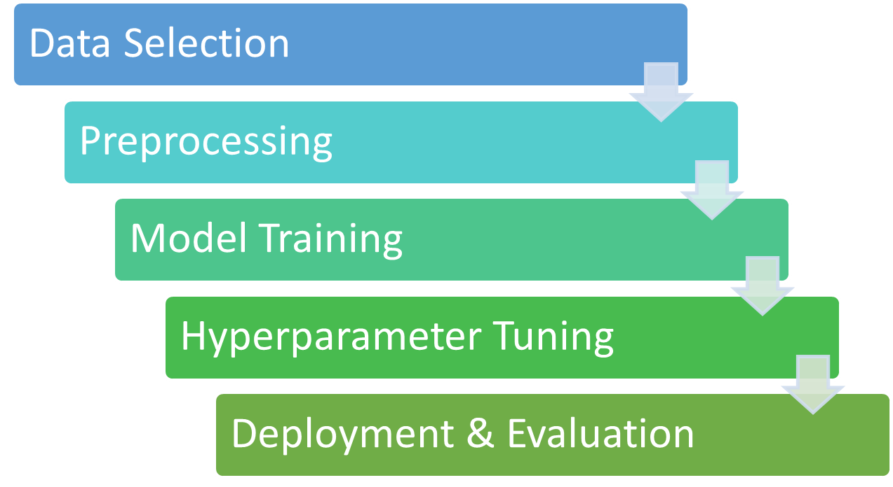
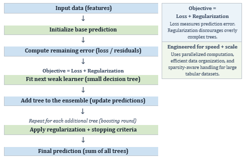
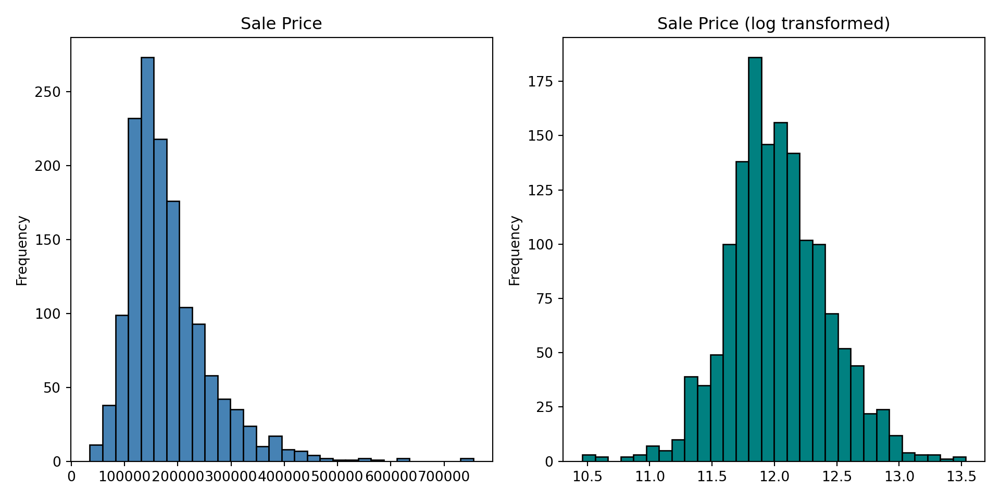
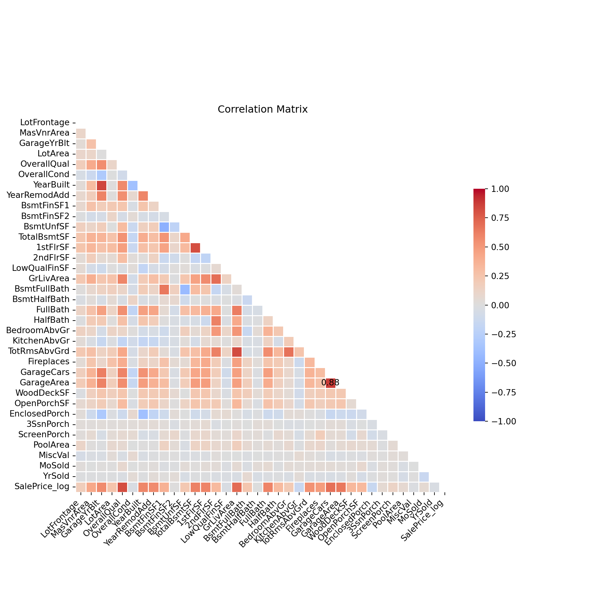
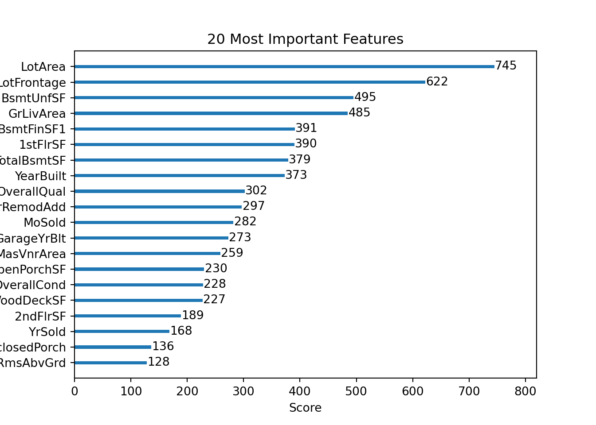

## Introduction

-   **The Why:** Predicting real estate sales prices affects those who buy, sell, and/or finance properties, including local governments
-   **The Business Question:** How well can a machine learning model like XGBoost predict real estate sale prices using a transaction-level dataset from a metropolitan market, and which features most influence those predictions?
-   **Overview:** Use XGBoost and a portion of Ames Housing datset

{fig-align="center"}

## Methods

-   **Model:** eXtreme Gradient Boosting (XGBoost)
    -   Great for structured, tabular data
    -   Salable and efficient
    -   Built-in mechanisms to prevent overfitting

{fig-align="center"}

## Data Exploration and Visualization

-   Kaggle dataset based on Ames Housing datset sourced from homes in Ames, Iowa, USA
    -   train.csv file with 1,460 rows and 81 features
-   Many categorical variables with a category "NA", so NA filter was set to False to not automatically assign these as missing data
    -   Reassigned true null values for 4 features

        -   LotFrontage (259) & MasVnrArea (8) became 0

        -   GarageYrBlt (81) became YearBuilt

        -   Electrical (1) was removed

## Data Exploration & Visualization (continued)

-   Skewness found in target variable SalePrice resolved with log transformation

{fig-align="center"}

## Data Exploration & Visualization (continued)

-   GarageArea & GarageCars highly correlated
    -   GarageArea dropped - common to consider garages by \# cars that could fit vs area

{fig-align="center"}

## Modeling and Results

-   **Overview:**

{fig-align="center"}

## Modeling & Results (continued)

-   **Preprocessing:**
    -   Handled missing values,
    -   Reduce multicollinarity by dropping the highly correlated column
    -   Log transformation on target variable to reduce skewness
-   **Split:** 80%/20%
-   **Encoding:** One-hot encoding for categorical variables
-   **Hyperparameter Tuning:** GridSearchCV
-   **Evaluation Metrics:** RMSE, R², MAE, MAPE

## Modeling & Results (continued)

-   Baseline established first, then tuned from GridSearchCV:

|                     |              |                 |
|:-------------------:|:------------:|:---------------:|
|     **Metric**      | **Baseline** |    **Tuned**    |
|  RMSE (log scale)   |    0.1264    |   **0.1208**    |
| RMSE (dollar scale) | \$21,896.01  | **\$19,666.92** |
|   R² (log scale)    |    0.9029    |   **0.9113**    |
| MAE (dollar scale)  | \$15,576.61  | **\$13,433.13** |
| MAPE (dollar scale) |    9.46%     |    **8.60%**    |

-   **RMSE:** average discrepancy between actual and predicted values for larger errors
    -   Log scale & dollar (\$) scale applied for interpretability
-   **MAE:** Absolute error on average home
-   **MAPE:** Absolute error on average home %
-   **R²:** Variance of the target variable explained (model fit)

## Modeling & Results (continued)

-   Most important features

{fig-align="center"}

## Modeling & Results (continued)

-   Actual vs predicted values

## Conclusion

-   Summarize your key findings.

-   Discuss the implications of your results.

## References

```{=html}
<style type="text/css">
  #refs {
    font-size: 25px;
}
</style>
```

::: {#refs}
:::
